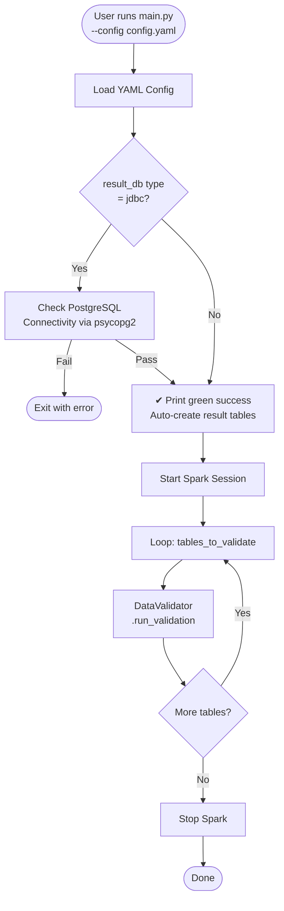
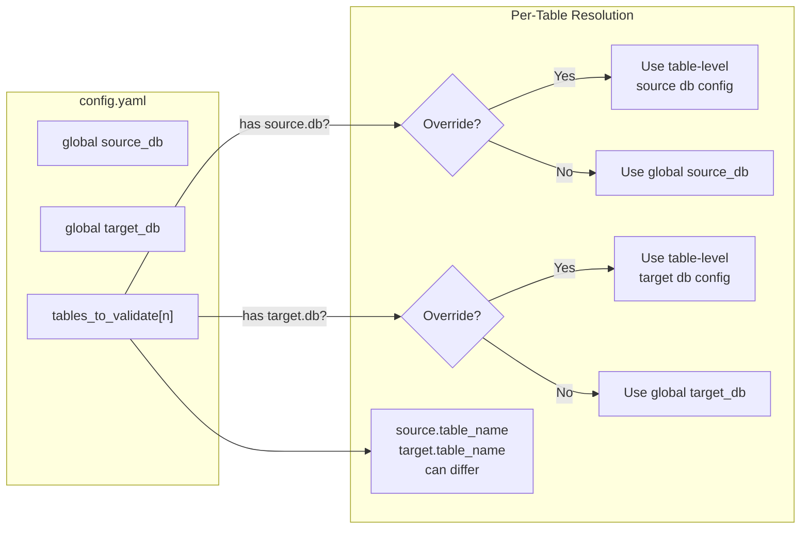
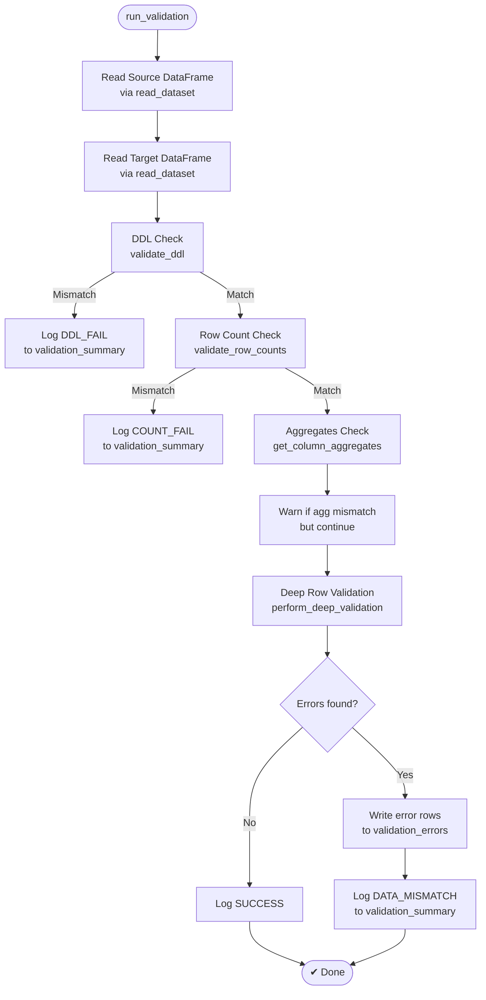
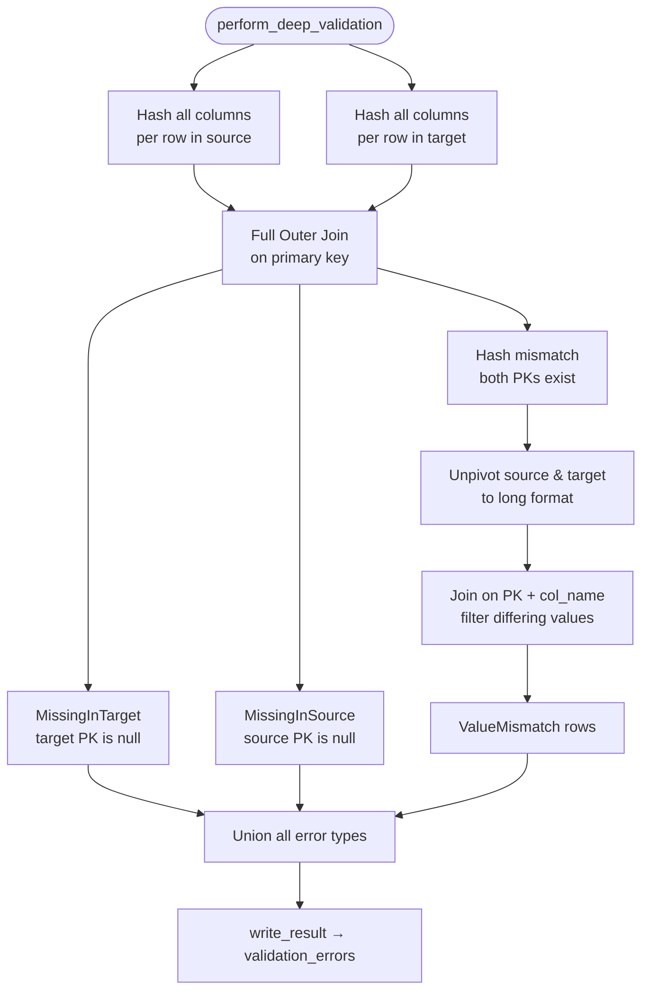
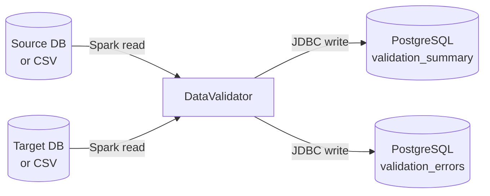
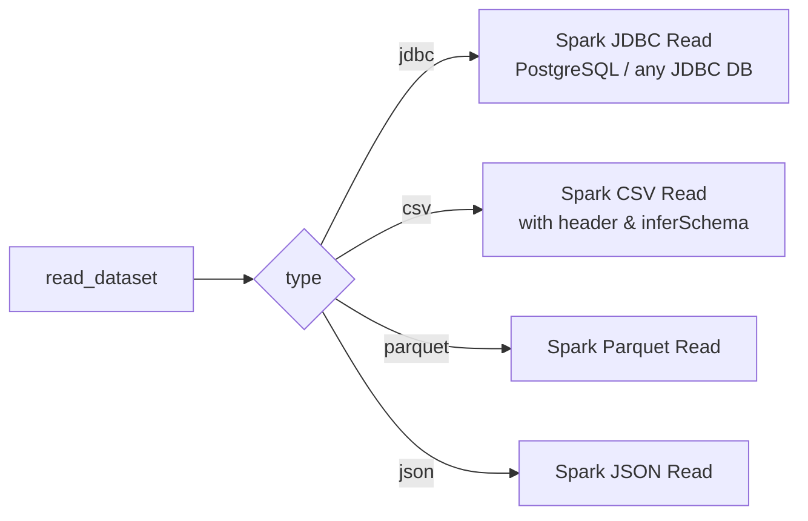
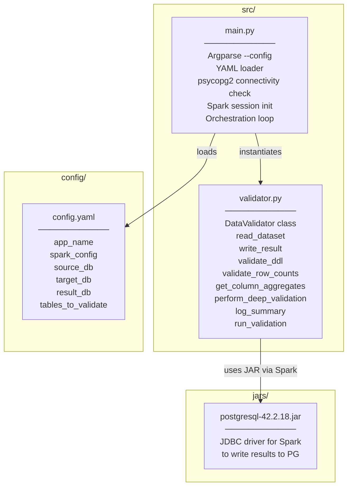

# Architecture & Code Flow

> Visual guide to how the Data Validation Framework works.

---

## 1. High-Level Overview

---

## 2. Config Resolution Per Table

Each table entry can independently override the global source/target DB.

---

## 3. Validation Pipeline (per table)

---

## 4. Deep Row-by-Row Validation

---

## 5. Data Flow: Source to Result

---

## 6. Source Types Supported

---

## 7. File & Module Responsibilities

