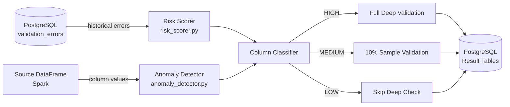
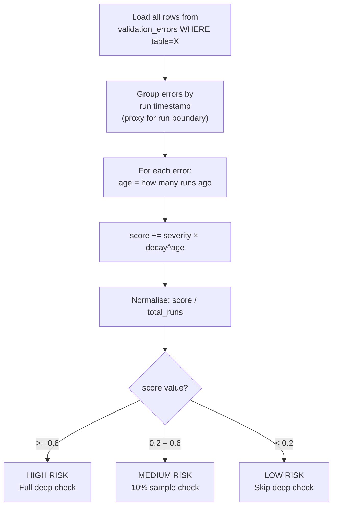
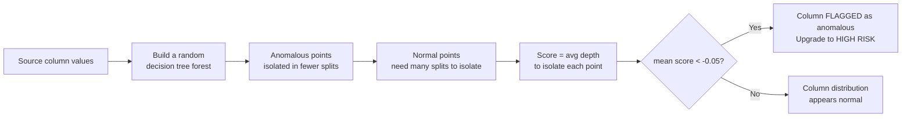
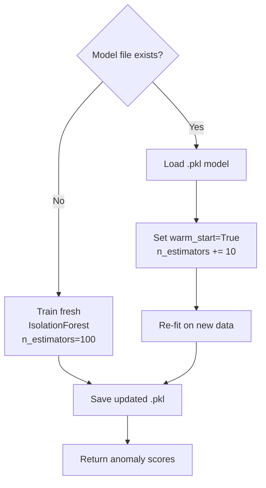
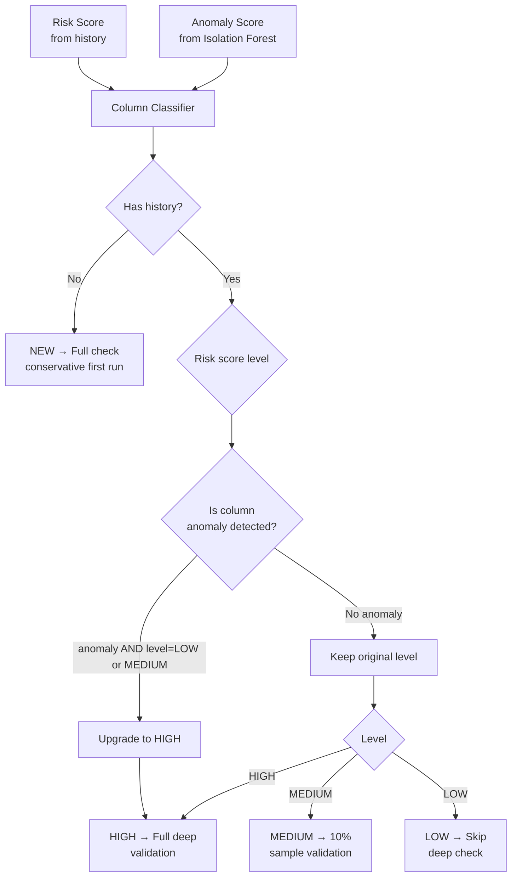
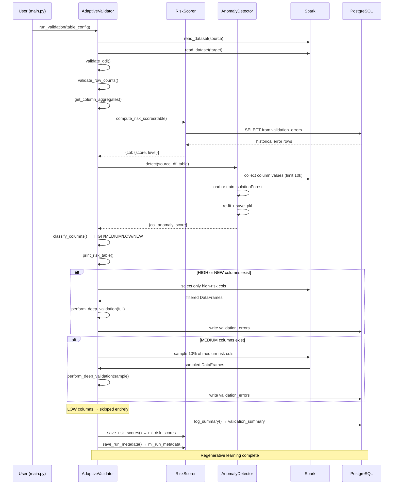
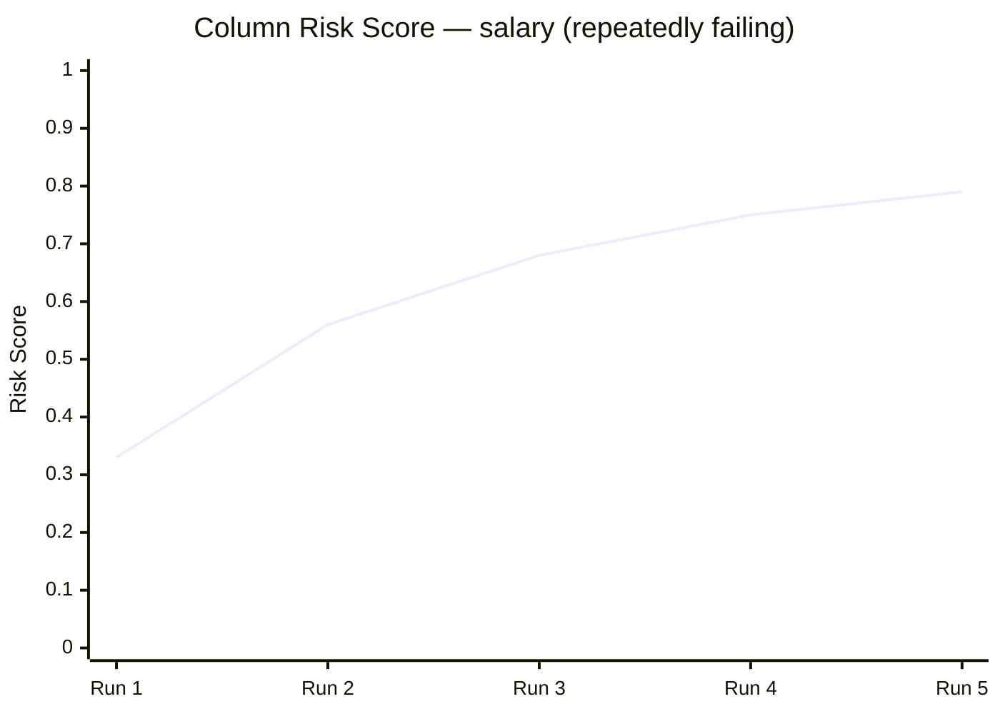
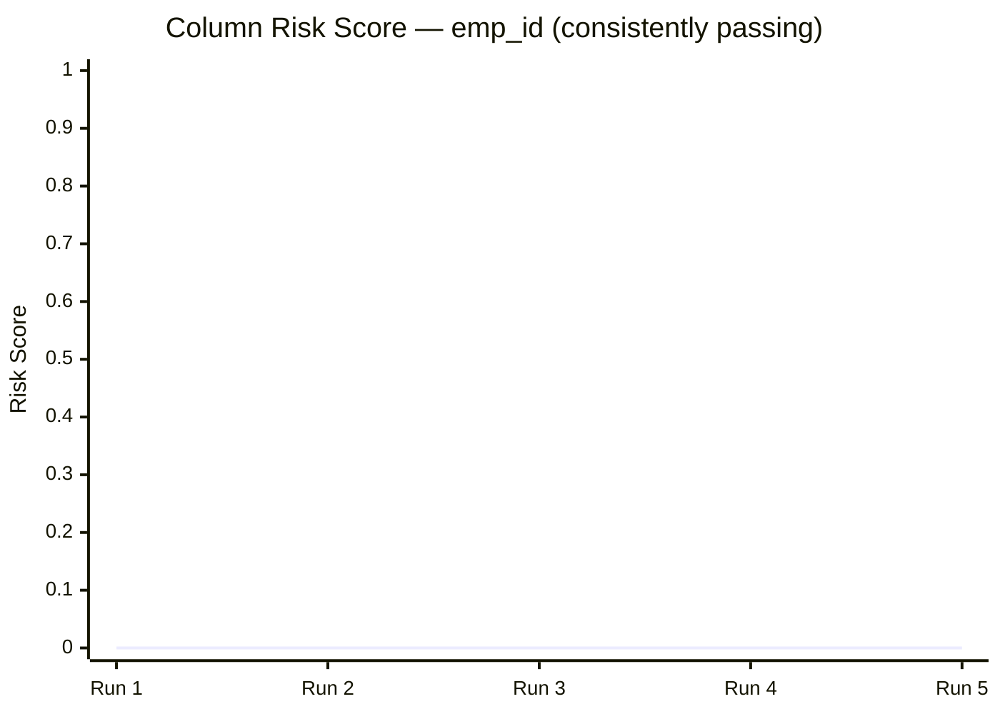
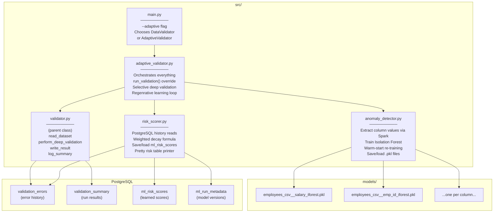

# ML Algorithm — Detailed Documentation

> How the Adaptive ML Validation Framework learns, decides, and improves over time.

---

## Overview

The framework runs **two independent ML systems in parallel** on every validation run and combines their outputs to decide _how deeply_ to validate each column:



---

## System 1 — Risk Scorer

### What it does
Reads the complete history of past validation errors for a table from PostgreSQL and computes a **weighted risk score** for each column.

### The Formula

```
risk_score(col) = Σ [ severity(error_type) × decay^age ] / total_runs
```

| Variable | Value | Explanation |
|---|---|---|
| `severity(ValueMismatch)` | 1.0 | Most critical — data value is wrong |
| `severity(MissingInTarget)` | 0.8 | Row exists in source but missing in target |
| `severity(MissingInSource)` | 0.6 | Extra row in target (less critical) |
| `decay` | 0.85 (configurable) | Older errors count less |
| `age` | 0, 1, 2 … | 0 = most recent run, 1 = one run ago |
| `total_runs` | count of distinct runs | Normalises across history length |

### Step-by-step walkthrough



### Concrete example

Assume `salary` has failed in the last 3 runs:

| Run ago | Error Type | Severity | Decay^age | Contribution |
|---|---|---|---|---|
| 0 (latest) | ValueMismatch | 1.0 | 0.85⁰ = 1.000 | 1.000 |
| 1 | ValueMismatch | 1.0 | 0.85¹ = 0.850 | 0.850 |
| 2 | MissingInTarget | 0.8 | 0.85² = 0.722 | 0.578 |

```
raw_score = 1.0 + 0.85 + 0.578 = 2.428
normalised = 2.428 / 3 runs = 0.809

→ 0.809 >= 0.6  →  HIGH RISK  →  Full deep validation
```

Whereas `emp_id` which never failed:
```
raw_score = 0  →  normalised = 0.0  →  LOW RISK  →  Skip deep check
```

### Why this algorithm?

> **Why not a neural network or gradient boosting?**

| Option | Problem |
|---|---|
| Neural network | Needs thousands of samples. A new table has 0 history. |
| Gradient boosting | Same — needs labelled training data upfront. |
| Rule-based thresholds | Static, never learns from new patterns. |
| **Weighted decay scoring** ✅ | Works from run 1. Improves incrementally. Explainable. Lightweight. |

The decay factor is key — it means errors from 10 runs ago have almost no influence (`0.85^10 = 0.20`) whereas an error from last run has full weight. This makes the model **self-correcting**: if a previously-failing column has been fixed and passes for several runs, its score drops naturally toward LOW RISK.

---

## System 2 — Anomaly Detector (Isolation Forest)

### What it does
Runs **Isolation Forest** on the actual column values read from the source DataFrame to detect if a column's data distribution is statistically unusual — even if that column has never failed validation before. This catches _new_ problems that haven't yet accumulated in the error history.

### Why Isolation Forest?



**Isolation Forest** was chosen because:

| Property | Why it matters |
|---|---|
| **Unsupervised** | No labelled "good" vs "bad" data needed |
| **No distribution assumption** | Works on skewed, non-Gaussian, mixed data |
| **Fast on large data** | O(n log n) — usable inside Spark collect cycles |
| **Built into scikit-learn** | No extra dependencies, production-stable |
| **Configurable contamination** | `contamination=0.1` means "expect 10% anomalies" |

**Alternatives considered:**

| Algorithm | Why rejected |
|---|---|
| Z-score / IQR | Assumes normal distribution — fails on salary distributions |
| One-Class SVM | Slow on large datasets, hard to tune |
| Autoencoder | Requires deep learning stack, overkill for column stats |
| Local Outlier Factor | Quadratic complexity — too slow for large DFs |

### Column encoding

| Column type | What is fed to Isolation Forest |
|---|---|
| Numeric (int, long, float, double) | Raw values |
| String | String length distribution |
| Other types | Skipped |

### Regenerative learning (warm start)



Each run **adds 10 more trees** to the existing forest. The model accumulates knowledge of what "normal" looks like for this column across all runs. By run 20, the forest has 300 trees — far more robust than any single training run.

---

## System 3 — Column Classifier (combining both signals)

### What it does
Takes the risk score (from history) and the anomaly score (from Isolation Forest) and makes a final decision per column.



**The anomaly detector acts as a safety net:** even if a column has been LOW RISK for 100 runs, if its values suddenly look anomalous in the current batch, it gets upgraded to HIGH — catching silent drift.

---

## Full Run Timeline



---

## How Learning Compounds Over Runs





After enough runs:
- `salary` score stabilises at ~0.80 → **permanently HIGH** → always deep-checked
- `emp_id` score stays at 0.0 → **permanently LOW** → deep check skipped entirely
- Validation time reduces proportionally as LOW columns accumulate

---

## Database Tables Created by the ML System

### `ml_risk_scores`
Stores the latest risk score per column. Updated (upserted) after every run.

| Column | Type | Description |
|---|---|---|
| `table_name` | TEXT | Source table being validated |
| `col_name` | TEXT | Column name |
| `risk_score` | FLOAT | Normalised 0–1 score |
| `risk_level` | TEXT | `HIGH`, `MEDIUM`, `LOW` |
| `error_count` | INT | Total historical errors for this column |
| `updated_at` | TIMESTAMP | When this score was last updated |

### `ml_run_metadata`
Tracks model evolution across runs.

| Column | Type | Description |
|---|---|---|
| `run_id` | TEXT | Timestamp-based run identifier |
| `table_name` | TEXT | Table validated in this run |
| `total_cols` | INT | Total columns in table |
| `high_risk_cols` | INT | Columns classified HIGH |
| `med_risk_cols` | INT | Columns classified MEDIUM |
| `low_risk_cols` | INT | Columns classified LOW |
| `model_version` | INT | How many learning iterations the model has seen |
| `run_at` | TIMESTAMP | When the run occurred |

---

## Configuration Reference

```yaml
ml_config:
  enabled: true               # Master on/off switch

  model_dir: "models/"        # .pkl files stored here (gitignored)

  risk_threshold_high: 0.6    # score >= 0.6 → HIGH RISK (full check)
  risk_threshold_low:  0.2    # score <= 0.2 → LOW RISK (skip)
                              # 0.2 < score < 0.6 → MEDIUM (10% sample)

  anomaly_contamination: 0.1  # IsolationForest: expected fraction of anomalies
                              # 0.1 = "expect 10% of values to be outliers"

  recency_decay: 0.85         # How fast old errors lose influence
                              # 0.85^5 ≈ 0.44  (5 runs ago = 44% weight)
                              # 0.85^10 ≈ 0.20 (10 runs ago = 20% weight)

  sample_fraction: 0.1        # MEDIUM risk: validate this fraction of rows
```

**Tuning guide:**

| You want to… | Change this |
|---|---|
| Make model more aggressive (more HIGH) | Lower `risk_threshold_high` (e.g. 0.4) |
| Make model forget old errors faster | Lower `recency_decay` (e.g. 0.7) |
| Detect subtler anomalies | Lower `anomaly_contamination` (e.g. 0.05) |
| Validate more rows in MEDIUM | Raise `sample_fraction` (e.g. 0.25) |
| Disable ML entirely | Set `enabled: false` or use `--adaptive false` |

---

## File Responsibilities


